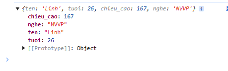
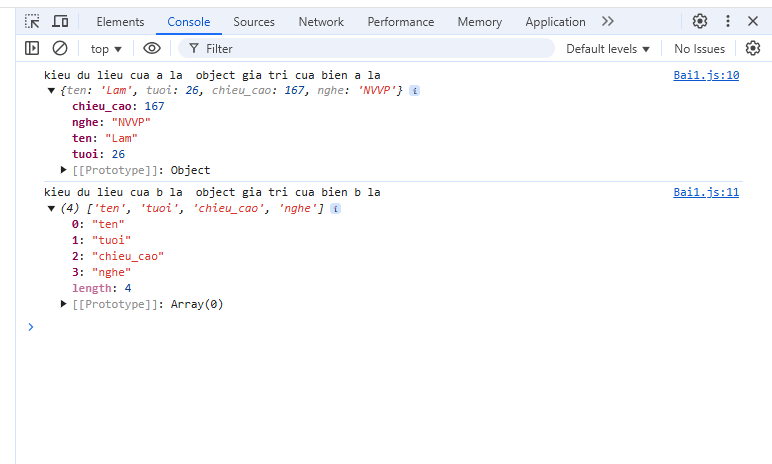

# Trước khi bắt đầu:

- Cài NodeJS để chạy code ở server side, sử dụng html để chạy JS trên trình duyệt (chrome). Có thể dùng option info ở tab console khi ấn F12 trên chrome để code JS mà không cần phải dùng VSCode

## Kiểu dữ liệu string và number

- Trong JS, không phân biệt int, float, double... mà chỉ có kiểu `number`, 
- Nên dùng dấu `` khi khai báo 1 string, có thể in ra cả các string nằm trong dấu nháy đơn '' và nháy kép ""
- Dùng hàm Number() để ép kiểu string --> number hoặc thêm dấu `+` trước biến cho nhanh, ví dụ:

                let a ='5'
                let b = +a
                console.log(typeof b)

Kết quả sẽ cho ra kiểu number

- Nên dùng dấu back stick (``) để khai báo, in ra string
- Dùng String template để khai báo 1 biến được lồng trong 1 string, VD:

        let a = 3
        let b = 2
        console.log(`Hôm nay là mùng ${a*b} Tết`)

Kết quả sẽ là:   Hôm nay là mùng 6 Tết
Dùng template string sẽ đỡ phải nối chuỗi, giảm sự cồng kềnh khi khai báo string

## Kiểu dữ liệu Object

- Khái niệm lập trình hướng đối tượng (OOP): Là mô phỏng lại những gì ngoài đời sống vào trong code, ví dụ như: mô tả người thì người sẽ có những đặc tính như chiều cao, cân nặng, tuổi... trong OOP thì đây là thuộc tính của đối tượng (properties). Ngoài những đặc tính thì con người còn có các hành động như: hát, nhảy, học tập, chơi... những hành động này là các hàm (function) trong code, hay còn được gọi là method (phương thức) trong OOP. 
+ Điểm khác biệt giữa method và function: function là các khối code độc lập, còn các method dù cũng là các function nhưng phải thuộc 1 object nào đó.
- Một object tương đương với 1 table trong database, các column của DB là các thuộc tính của object, row của table chính là value của object đấy
- Khi không chắc giá trị của 1 thuộc tính, muốn gắn giá trị động cho thuộc tính, ta khai báo như sau:

        let nguoi = {
            ten: "Lam",
            tuoi: 26,
            chieu_cao: 167,
            nghe: 'NVVP'
        }

        let c = 'ten'
        nguoi[c] = "Linh"
        console.log(nguoi)

Kết quả sẽ như sau:

## Kiểu dữ liệu Array

- Array bản chất cũng là 1 object. Khi in ra kiểu dữ liệu của array sử dụng typeof sẽ là object.
- Điểm khác biệt giữa array và object:
+ object quản lý các giá trị của nó thông qua `key` còn array quản lý các phần tử thông qua index, ví dụ:

                let a = {
                        ten: "Lam",
                        tuoi: 26,
                        chieu_cao: 167,
                        nghe: 'NVVP'
                }               

                let b = ['ten', 'tuoi', 'chieu_cao', 'nghe']

                console.log('kieu du lieu cua a la ', typeof a, 'gia tri cua bien a la ', a)
                console.log('kieu du lieu cua b la ', typeof b, 'gia tri cua bien b la ', b)

Kết quả sẽ như sau:

Như hình trên thì các `key` của object a tương ứng với các index của mảng b: `ten` tương ứng với index 0, `tuoi` tương ứng với index 1... 
Một array có thể chứa các string, number, object... khi đi làm thì kiểu dữ liệu array có chứa object sẽ dùng nhiều.            
+ array hỗ trợ nhiều loại method hơn object