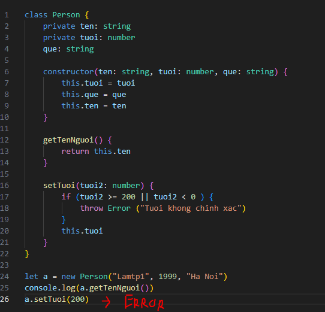

- File index.html và main.js dùng sử dụng trong suốt quá trình học JS.
- Để sử dụng file index.html và main.js vừa tạo, dùng một cặp thẻ `script` trong phần `body` của file HTML.
- `src=""` nguồn tài nguyên mà ta muốn cung cấp cho  thẻ script --> dùng file main.js vừa tạo.
Để hiện lên header như hình dưới, thì thêm thẻ h1 ở phần body của file html:

Còn câu `Hello Java...` , là do hàm `alert()` ở main.js. Alert là hàm hiện pop up cảnh báo. Trong một thời điểm, alert chỉ hiện 1 thông báo, nếu có 2 thông báo thì ấn `ok` xong mới hiện thông báo thứ 2.

### Khai báo biến

- dùng `var` để khai báo, theo chuẩn thì nếu biến có 1 từ thì viết thường, 2 từ thì viết thường từ đầu, viết hoa chữ cái đầu của từ thứ 2. VD: hocSinh, sinhVien, xeMay...
- Không có dấu `;` vẫn chạy bình thường nhưng không viết 2 lệnh trên cùng một dòng được.

### Comments:

- Gõ `/**` để VsCode tự gợi ý comment khối code.

### Các hàm built in (được JS xây dựng sẵn), gồm 6 hàm cơ bản hay dùng:

1. Alert
2. Console
3. Confirm
4. Prompt
5. Set timeout
6. Set interval

- Hàm console in ra thông báo trên console của trình duyệt. Console có thể coi là object (đối tượng), dùng dấu `.` sau console để chọn phương thức (method). method log để hiện dòng log, có thể đưa biến vào method log. Ta sẽ dùng console.log là chính để debug.
VD:

Sẽ hiện ra dòng như dưới

Hoặc nếu để là console.warn thì sẽ có thêm dấu cảnh báo:

- Hàm `confirm` dùng để xác nhận, VD: xác nhận đủ tuổi trước khi truy cập website, khi dùng sẽ ra hộp thoại pop up.
- Hàm `prompt` dùng để hiện pop up cho phép người dùng nhập từ keyboard. VD nhập tuổi khi bị hỏi ở hàm confirm.
- Hàm `setTimeout`: truyền vào một function cho đoạn code chạy sau một khoảng thời gian, đơn vị ms. Tham số 1 là function, tham số 2 là thời gian.
VD về hàm `setTimeout`:

Sau 2s (2000ms) sẽ có thông báo như dưới:

- Hàm `setInterval` khác hàm `setTimeout` ở chỗ cứ sau một khoảng thời gian thì chạy một lần, còn hàm setTimeout chỉ chạy 1 lần:

Kết quả sẽ như sau, có 6 dòng `51` ở console log do đã qua 6 giây, log giống nhau sẽ gộp chung 1 dòng:

VD về hàm `prompt`:

#### `Tóm lại:` 
- Hàm Alert, confirm, prompt đều là hàm hiện của sổ pop up, hàm prompt là kết hợp của alert và confirm nhưng thêm chỗ để nhập thông tin.
- setTimeout chạy 1 đoạn code sau 1 khoảng thời gian và chạy 1 lần.
- setInterval cũng tương tự nhưng chạy nhiều lần.

### Toán tử trong JavaScript:

- Toán tử số học: +, -, *, /
- Toán tử gán: dấu `=`
- Toán từ so sánh: >=. <=, ==
- Toán từ logic: &&, ||...

### Toán tử ++ -- với tiền tố và hậu tố

- TH1: `a++`

Kết quả như dưới:

+ B1:  a copy = 1
+ B2: cộng 1 của a, a = a + 1 --> a = 2
+ B3: Trả về biến a copy (=1)

- TH2: `++a`

Kết quả đều bằng 2.
+ B1: +1 cho a, a = a + 1 --> a = 2.
+ B2: Trả về a sau khi được cộng 1 (a = 2).

### If-else

- Trong JS có 6 kiểu giá trị sau khi convert sang boolean sẽ là `false`, nếu khác 6 giá trị này sẽ là `true`:
1. `0`
2. `false`
3. `''`, `_`, `""`: rỗng
4. `undefined`
5. `NaN`
6. `null`

### Kiểu dữ liệu 

1. Dữ liệu nguyên thủy - primitive data
- Number
- String
- Boolean
- Undefined
- Null
- Symbol

là kiểu dữ liệu được tạo ra lưu vào vùng nhớ và không thể sửa được giá trị trong vùng nhớ
VD: var a = 1 thì 1 sẽ được gán vào vùng nhớ x trên RAM và không thể sửa 1 bằng giá trị khác, nếu khai var a = 2 thì một vùng nhớ mới được tạo ra, giá trị 1 ở vùng nhớ cũ vẫn không đổi.

2. Dữ liệu phức tạp - Complex data
- Function
- Object

Chứa nhiều phương thức và thuộc tính hơn kiểu dữ liệu nguyên thủy. 
Object có 2 khái niệm là array và object.

Kiểu dữ liệu object dùng nhiều để lưu các dạng dữ liệu mà ta tương tác trung jv (giống connstruct trong C++)

### Cách auto build file .ts khi ấn ctrl+s

1. Ở trong thư mục project, vd nếu file code ở C:\IT_BRAIN\learning\TypeScript\Bai3\Bai3.ts thì không cần cd vào thư mục `Bai3` mà chỉ cần vào thư mục TypeScriptl là đủ. Ở đây gõ `tsc --init` để tạo file `tsconfig.json`
2. Sau khi tạo file này, ấn tổ hợp phím `ctrl + shift + b` để chọn `tsc: watch - learning\TypeScript\tsconfig.json` để tự động build file .ts thành file .js
3. Tạo file html ở cùng thư mục chứa file .ts với phần body để tên file .js sẽ sinh ra khi save file .ts, từ giờ mỗi khi lưu file .ts sẽ tự động tạo file .js tương ứng. Chọn `Go live` nếu đã cài live server từ trước, ấn F12 để debug, ta sẽ thấy mọi thay đổi khi lưu file .ts ở màn debug

### Kiểu dữ liệu trong TS (data types):

Có 2 loại type là keyword 'Type' và data 'Type', trong data type thì sẽ có 2 loại như dưới:

1. Kiểu dữ liệu nguyên thủy (primitive data type):

- Booleen, String, int, symbol, bigint

2. Kiểu dữ liệu tham chiếu (reference data type):

- Object, array, functions

### khai báo 1 biến trong TS:

let/const/var [tên biến]: [kiểu dữ liệu] (= value --optional) 
vd:
        let myName: string = 'Lamtp1'

Có thể không cần khai báo giá trị Lamtp1 cũng được.

Lưu ý khi dùng `const` để khai báo biến thì cần phải khởi tạo giá trị cho biến ấy ngay, không thể assigned giá trị như này được:

        const demChuSo: number;
        demChuSo = 10;

==> Viết thế này sẽ báo lỗi, mà phải viết lại như sau:

        const demChuSo: number = '10';

Tuy nhiên dùng `let` hoặc `var` thì viết như trên được

- Type Anotation trong ví dụ trên là đoạn `: number` để thông báo/chú thích cho TypeScript biết kiểu dữ liệu mình sẽ dùng cho biến.

### Type inference và khi nào nên dùng Type Annotations, khi nào dùng tpye inference:

- Type inference (tự động gán type): là tính năng tự suy đoán kiểu dữ liệu của TypeScript, VD:

        let count = 1
        count = 'lamtp1'

Nếu gõ như trên sẽ báo lỗi vì giờ đây TS sẽ tự gán kiểu cho biến count là number nên không thể gán kiểu string được nữa.
Tương tự, nếu gõ:

        let myName = ['Lamtp1', 'Tinhvv2', 'Anth79']
        myName.push(1)

Sẽ báo lỗi do TS đang hiểu kiểu mặc định của mạng là string[]
Tuy nhiên, trong VD dưới:

        let myName = ['Lamtp1', 'Tinhvv2', 'Anth79', 6]
        myName.push(1)

Viết thế này thì TS sẽ hiểu là mảng `myName` sẽ cho phép 2 kiểu dữ liệu là string và number nên sẽ không bị lỗi, tương tự như việc khai báo đẩy đủ kiểu dữ liệu như sau:

        let myName: (string | number) = ['Lamtp1', 'Tinhvv2', 'Anth79', 6]

- Dùng type inference nếu muốn thay đổi kiểu dữ liệu của biến trong quá trình code, type annotaions nếu muốn kiểu dữ liệu cố định trong suốt quá trình code
- Khi không chắc chắn về kiểu dữ liệu của biến trong tương lai thì dùng type inference

#### Lưu ý: Không sử dụng kiểu dữ liệu viết hoa: String, Number, Object, Symbol, Boolean khi muốn khai kiểu dữ liệu nguyên thủy cho từng biến con, chỉ viết hoa khi muốn khai báo kiểu dữ liệu cho đối tượng, class.

### Khác nhau giữa viết thường và viết hoa tên kiểu dữ liệu:

- String, Number, Boolean... là các kiểu đối tượng - wrapper object dùng để khởi tạo `đối tượng` với kiểu tương ứng, vd:

        let myName: boolean = Boolean('Lamtp1')
        console.log("Gia tri tra ve la: ", myName)

Giá trị trả về của vd này sẽ là true do Boolean() sẽ trả về true nếu chuỗi không rỗng
Nếu viết như sau:

        let myName: string = Boolean('Lamtp1')

Thì sẽ báo lỗi giá trị trả về kiểu boolean sẽ không thể gán biến có kiểu string được. Boolean() sẽ trả về giá trị kiểu boolean, Number() sẽ trả về giá trị kiểu number, và chỉ được truyền 1 giá trị vào hoặc không truyền gì cả. Nếu không truyền giá trị vào Number() thì kết quả trả về là 0 trên console log, nếu truyền giá trị khác số vào, như string vào Number() thì sẽ trả về `NaN - Not a number`, không truyền gì vào Boolean() sẽ trả về false, còn nếu truyền string hoặc number vào sẽ trả về true.

Nếu không khai báo kiểu của biến mà gán luôn value của biến bằng wrapper object thì TS sẽ hiểu kiểu dữ liệu của biến = kiểu dữ liệu trả về của wrapper object, VD:

        let myName = String(false)
        console.log(myName)
        
Viết thế này TS sẽ hiêu kiểu dữ liệu của myName là string, kết quả trả về console log sẽ là false, String() khác Number() ở chỗ nó sẽ nhận bất cứ giá trị nào và chuyển về dạng chuỗi của giá trị đó, kể cả số 1, 2, 3 hay kiểu boolean true và false. Number() nếu truyền giá trị khác số thì trả về `NaN`

--> Nói chung cần phải đảm bảo kiểu dữ liệu khi khai báo biến giống kiểu trả về của kiểu đối tượng (Boolean(), String(), Number()...).
Ta sẽ hầu như không dùng wrapper object bao giờ do sẽ tạo ra một đối tượng gây tốn bộ nhớ

- Hàm String() là chuyển đổi kiểu dữ liệu, không phải là một đối tượng kiểu string. Để khai đối tượng thì phải như sau:

        let myName: String = new String(false)

Sẽ tạo một đối tượng kiểu string, còn nếu không có new thì kết quả là một chuỗi kiểu nguyên thủy, không phải đối tượng. Kiểu đối tượng thì sẽ tốn bộ nhớ hơn nhưng sẽ có các tính năng bổ sung của một đối tượng

### Kiểu dữ liệu object:

Trong JS, khai báo 1 Object cần có cặp key-value như sau:

        let mine = {}
        mine = {name: "lam"}

Nếu chỉ khai let mine = {} thì đây sẽ là 1 object rỗng

        let mine = []
        mine = [0.1, 0.2]
        console.log("Ten toi la ", mine, typeof mine)

Array cũng là một kiểu dữ liệu Object, khác nhau ở thuộc tính nội bộ (internal properties) Prototype, prototype khi khai `let mine = {}` sẽ là object còn prototype khi khai `let mine =[]` là array

Có thể khai báo 1 mảng gồm nhiều đối tượng như sau:

        let hocSinh = [
            {ten: "Lamtp1", tuoi: "25", maNV: "428118"},
            {ten: "Tinhvv2", tuoi: "26", maNV: "258999"},
            {ten: "Linhnd47", tuoi: "24", maNV: "438999"}
        ]
        console.log("người 1 là: ", hocSinh[0], "\nngười 2 là: ", hocSinh[1])

Khai như này thì prototype của hocSinh là array, nhưng prototype của từng các phần tử trong mảng là object

Hoặc như sau:

        let tenNguoi: {
            tuoi: number
            ten: string
            namSinh: number
        } 
        let nguoi1 = tenNguoi = {
            ten: "lamtp1",
            tuoi: 34,
            namSinh: 3333
        } 

        let nguoi2 = tenNguoi = {
            ten: "tinhvv2",
            tuoi: 26,
            namSinh: 1998
        }
        console.log("Người số 1 là ",nguoi1, "\nNgười số 2 là: ",nguoi2)

Khai như này thì prototype của tenNguoi = nguoi1 = nguoi2 là object. Khai báo biến nguoi1 rồi gán giá trị nguoi1 bằng tenNguoi => nguoi1 sẽ có kiểu dữ liệu là đối tượng và các thuộc tính của tenNguoi

Trong TS, khai báo object có nhiều cách:
C1:

        let tenNguoi: object = { name: "Lamtp1", address: "ngo 87" }

Cách 1 này dùng oke nhưng không thể định nghĩa kiểu dữ liệu của các thuộc tính (name, address) khi khai báo được 
C2:

        let tenNguoi: {
            name: string
            address: number
        } = {
            name: "lamtp1",
            address: 11
        }

Đây là cách hay dùng nhất do ngắn gọn và define được kiểu dữ liệu của thuộc tính trước khi nhập, khi dịch đoạn trên qua .js thì nó sẽ mất kiểu dữ liệu của thuộc tính như sau:

        let tenNguoi = {
            name: "lamtp1",
            address: 11
        };

### Kiểu dữ liệu Array:

- Khai báo:

        let mangSo = [1, "Lam", "Linh", 6, 4];

Kiểu dữ liệu này cũng là object

### Kiểu dữ liệu Tuples:

- Hoạt động giống kiểu Array, khác ở chỗ:
+ Kiểu dữ liệu của từng phần tử phải khai báo trước
+ Phải khai báo số phần từ của mảng trước

VD:

        let mangTuple: [string, number] = ["Lamtp1", 34]

Ở đây ta xác định luôn phần tử đầu tiên của mảng là string, phần tử số 2 là số và mảng sẽ chỉ có 2 phần tử.

        let mangTuple: [string, number, boolean?] = ["Lamtp1", 34]

Hoặc viết thể này cx được, TS sẽ hiểu rằng giá trị thứ 3 có thể không có cũng được nhưng nếu có thì phải là kiểu boolean

### Kiểu dữ liệu enum:

Enum (enumerated: liệt kê one by one) là 1 nhóm các giá trị hằng số.
- Khai báo:

        enum [tên_enum] {constant1, constant2,...}

### `Trong typescript, khi đang định nghĩa biến sẽ không có dấu '=', dấu '=' dùng khi gán giá trị.`

- VD:

        enum ketQuaThi {
            QUA_MÔN, TẠCH, PENDING
        }

        let a1: ketQuaThi = ketQuaThi.PENDING
        let a2 = ketQuaThi.QUA_MÔN
        let a3 = ketQuaThi.TẠCH

typeof của các biến a1, a2, a3 sẽ là number chứ không phải là enum do gán chỉ số index của phần từ trong mảng cho a1,a2,a3 --> là number. Enum được dùng để nhóm các constant hay dùng vào 1 biến để tránh bị gõ nhầm khi gọi đến constant ấy.

        enum ketQuaThi {
            QUA_MÔN = "QUA_MÔN", TẠCH = "TẠCH", PENDING = "TẠCH"
        }

Viết thế này để gán giá trị vào từng phần tử trong enum

### Any Type

- Nếu không chắc giá trị trả về của biến thì dùng any type để gán kiểu dữ liệu động cho biến
- Khai báo:

        let myName: any = "Lam"
        myName = 33

Khi compiler của TS gặp từ khóa `any` thì nó sẽ không check kiểu dữ liệu nữa và muốn gán giá trị gì cho biến lúc ấy cũng được. any chỉ dùng với kiểu dữ liệu phức tạp, convert từ dự án js sang ts, tránh lạm dụng vì sẽ không khác gì code js. Nếu để kiểu any thì sẽ mất hết tính năng gợi ý code của ts

### Void type:

- Kiểu dữ liệu không trả về gì, dùng khi chỉ muốn tạo 1 hàm lưu dữ liệu vào database hay call API --> Chỉ quan tâm đến logic của hàm mà không quan tâm đến giá trị trả về
VD:

        var inBanTin = (x: string): void => {
            console.log("Ban tin: ", inBanTin("Thoi su"))
        }

Hàm trên khi nhìn trên console log sẽ không thấy thông tin gì

VD2:

        var sum = (a: number, b: number): (string | number) => {
            return a + b
        }

        console.log("Tong la ", sum(2, 4))

Hàm này thì trả về giá trị là tổng a và b, kiểu dữ liệu của biến sum là function. Kiểu void này hầu như chỉ dùng với function mà không dùng với biến

### Type never:

- Never là một kiểu dữ liệu không có thực, không thể xảy ra - never, VD:

        function test(tinNhan: string): never {
            while (true) {
                console.log("Oke men")
            }
        }

        console.log(test("xxx"))

(string & number) là type never vì giá trị trả về của 1 hàm không thể vừa là number vừa là string được. Never thường dùng cho function handle exception và function chạy không có hồi kết
- Khác nhau giữa void và never: void thực chất sẽ trả về 1 giá trị đặc biệt là `undefined`, còn never không trả ra gì. 

### Type union

- Cho phép 1 biến có thể mang 2 hay nhiều kiểu dữ liệu, VD:

        let a: number | string 

- Ngoài ra union còn giúp ta biết lỗi ngay trước khi biên dịch mà không cần phải khi chạy chương trình mới nhận ra lỗi, VD:

        function chuoiSoOrChu(a: any, b: any) {
            if (typeof a == 'number' && typeof b == 'number') {
                return a + b
            }
            if (typeof a == 'string' && typeof b == 'string') {
                return a.concat(b)
            }
            throw Error("Phải cùng là chữ hoặc số")
        }

        console.log("Kết quả là: ", chuoiSoOrChu(true, "lam"))

Ở VD trên, phải chạy chương trình mới nhận ra lỗi do biến a,b có kiểu dữ liệu tùy ý tuy nhiên thuộc tính concat() chỉ có thể nối string chứ không nối string và boolean được. Do vậy, khi truyền cả string và boolean vào hàm chuoiSoOrChu thì khi chạy sẽ báo lỗi. Để trước khi chạy biết lỗi ở đâu, ta sẽ siết điều kiện cho a,b sử dụng union type: a: string|number, khi đó truyền true vào hàm sẽ báo lỗi trước khi compile

### Type Aliases:

- Type aliases cho phép tạo mới 1 kiểu type từ những type đã tồn tại, VD:

        type lamtp1 = string | number | boolean

### Switch case và if else:

- Switch case giống như if else, dùng trong trường hợp có nhiều điều kiện, giúp cho code tường minh hơn dùng if-else
- Cú pháp if else:

        if (expression) {

        } else if () {

        } else {
            
        }

Nếu truyền vào if 1 biến thay vì 1 biểu thức (vd như if (a) thay vì if (a > 5 )) thì hàm if sẽ trả về statement đầu tiên nếu a không rỗng (true) và trả về statement thứ hai nếu a rỗng hoặc a=0 (false)

- Cú pháp switch-case:

        let a: number = 7, b = 4
        switch (a) {
            case 7:
                console.log("Chính xác")
                break;
            case 4:
                console.log("không đúng")
                break;
            default:
                break;
        }

TH cả 2 giá trị đều cho ra expression như nhau thì viết như sau:

        switch (a) {
            case 4:
            case 7:
                console.log("Chính xác")
                break;
            default:
                console.log("Dell cái nào đúng cả")
                break;
        }

Cả TH a=4 và a=7 đều in ra màn hình "Chính xác"
   
### Vòng lặp For-while

- Dùng for khi biết chắc số lần lặp, format:

        for (let index = 0; index < array.length; index++) {
            const element = array[index];
            
        }
VD:

        const mangSo: number[] = [2, 3, 4, 5, 6, 7]
        for (let index = 0; index < mangSo.length; index++) {
            const element = mangSo[index];
            console.log("So tiep theo la: ", element)
        }

- Dùng while khi không biết chắc số lần lặp, và chỉ cần biết khi nào nên dừng, format:

        while (condition) {
            
        }

VD:
        const mangSo: number[] = [2, 3, 4, 5, 6, 7]
        let i = 0
        while (i < 6) {
            console.log("Phần tử ", "a[",i,"]", "là:", mangSo[i])
            if (i == 6) {
                break
            }
            i++
        }

- VD này cũng in các phần tử trong mảng tương ứng với vòng for trên.
#### Vòng lặp do-while

- Vòng lặp do-while khác while ở chỗ cho phép chạy vòng lặp ít nhất 1 lần, không cần quan tâm điều kiện:

        const mangSo: number[] = [2, 3, 4, 5, 6, 7]
        let i = 0
        do {
            console.log("Phần tử ", "a[",i,"]", "là:", mangSo[i])
            if (i == 6) {
                break
            }
            i++
        } while (i < 0);

Bình thường while lên đầu với đk i<0 thì sẽ không in ra kết quả, còn do-while thì vẫn sẽ chạy 1 lần và cho kết quả a[0] = 2

### Break:

- Trong 1 khối code {expression}, đoạn code ở dưới `break` đều không chạy được vì TS khi gặp break sẽ thoát ra khỏi khối code

        let hocSinh = [
            {ten: "Lamtp1", tuoi: 26, maNV: "428118"},
            {ten: "Tinhvv2", tuoi: 25, maNV: "258999"},
            {ten: "Linhnd47", tuoi: 24, maNV: "438999"}
        ]
        // console.log("người 1 là: ", hocSinh[0], "\nngười 2 là: ", hocSinh[1], typeof hocSinh[0])

        for (let index = 0; index < hocSinh.length; index++) {
            if (hocSinh[index].tuoi==24){
                break;
            }
            console.log("Học sinh",index,"là: ", hocSinh[index])
        }

Nếu để đoạn console.log dưới break và trong hàm if thì sẽ gặp lỗi `unreachable code detected` vì sau break TS sẽ tự hiểu là phải thoát ra khối code trong vòng lặp. Nên phải để console.log bên ngoài mới hết lỗi. 

- Hàm switch case mà ko có break sẽ chạy từ trên xuống dưới --> giá trị default mà không thoát ra khi gặp kết quả mong muốn

### Continue:

- Khác với break là thoát khỏi vòng lặp, không chạy gì cả, thì continue là chỉ skip 1 vòng và chạy vòng tiếp theo nếu điều kiện thỏa mãn. `continue` được hiểu là tiếp tục chạy vòng lặp tiếp theo. VD:

        let hocSinh = [
            {ten: "Lamtp1", tuoi: 25, maNV: "428118"},
            {ten: "Tinhvv2", tuoi: 26, maNV: "258999"},
            {ten: "Linhnd47", tuoi: 27, maNV: "438999"},
            {ten: "Ngocnh3", tuoi: 28, maNV: "3242323"},
            {ten: "Thangdc2", tuoi: 29, maNV: "423423"},
            {ten: "Hiennd9", tuoi: 30, maNV: "867845"},
            {ten: "Anhtt211", tuoi: 31, maNV: "545577"},
            {ten: "Namph17", tuoi: 32, maNV: "576844"},
            {ten: "Dungtv33", tuoi: 33, maNV: "234845"}
        ]

        for (let index = 0; index < hocSinh.length; index++) {
            if (hocSinh[index].tuoi % 2){
                continue;
            }
            console.log("Học sinh",index,"là: ", hocSinh[index])
        }

VD trên sẽ in ra các object có thuộc tính `tuoi` chẵn, tuổi lẻ thì sẽ skip. Ở hàm if, khi chia dư cho 2 được 1 sẽ hiểu là true, và chạy lệnh continue, VD tương tự dùng while:

                let i = 0
                while (i < 8) {
                if (hocSinh[i].tuoi % 2 == 0){
                        i++ 
                        continue
                }
                console.log("Học sinh",i,"là: ", hocSinh[i])
                i++  
                }

### Functions:

- Khai báo function truyền thống:

                function sum1 (a: number, b: number){
                        return a+b
                }

- Khai báo arrow function: 
Bản chất  arrow function là một anonymous function có cú pháp:

                () => {}

Ta cần đặt tên function để biết dùng annoymous function nào, vậy nên cú pháp hoàn chỉnh của arrow function là:

                let sum1 = (a: number, b: number): number => {return a + b}

                console.log("Tổng a + b là ", sum1(6,7))

+ Đối với type script phải định nghĩa type của tham số truyền vào và type của hàm trả về (có thể để trống để TS tự đoán cũng được)
#### optional parameter:

Trong typescript, có thể không cần khai báo hết các tham số khi gọi hàm bằng cách đặt dấu `?` sau tham số khi khai báo hàm:

                const sum2 = (a: number, b: number, c?: number) => {
                if (c) { // Nếu c tồn tại
                        return a + b+ c
                }
                return a + b
                }

                console.log("Tổng là: ", sum2(1, 2))

Hàm trên sẽ trả về giá trị Tổng là 3, nếu không có dấu `?` sẽ báo lỗi thiếu tham số. TS sẽ check xem hàm đủ tham số chưa trước rồi sau đó check kiểu dữ liệu tham số

- argument: đối số, truyền vào hàm khi gọi
- parameter: tham số, truyền vào hàm khi khởi tạo

#### default parameter:
Truyền tham số mặc định vào hàm,  giúp quyêt định kết quả trả về của hàm, VD:

                const sum2 = (a: number, b: number, c = false) => {
                if (c) { // Nếu c tồn tại
                        return a + b 
                }
                if (c == false){
                        return a - b
                }

                }
                console.log("Tổng là: ", sum2(1, 2, true), sum2(1, 3))

`Kết quả là 3 và -2`
#### rest parameter: 
> khi số lượng tham số sẽ truyền vào hàm không rõ số lượng ta dùng rest params, trong javasript thì dùng biến `arguments`, còn trong typescript thì dùng dấu `...`
> ta có thể truyền nhiều đối số hoặc không truyền đối số nào (argument) vào rest param. Trình biên dịch sẽ tạo 1 mảng các đối số với tên rest param được đặt tùy ý
> rest param phải là array vì có thể chứa nhiều hơn 1 đối số sau này.
VD:

                const sum2 = (a: number, b: number, ...c: number[]) => {
                        let tinhTong = 0
                        c.forEach(num => tinhTong += num)
                        return tinhTong + a + b
                }
                console.log("Tổng là: ", sum2(1, 2, 4, 5), sum2(1, 3))

Kết quả của VD này là `12 4`. Bằng `4` do mảng c rỗng mà kết quả return của hàm sum2 là tinhTong + b + a, tinhTong = 0 do chỉ tính tổng các phần tử trong mảng c

- Callback function là function được dùng làm param của 1 fucntion khác --> là function trong 1 function, ở vD trên thì `num => tinhTong += num` là 1 hàm callback của `forEach()`

#### Function overloading:

- Khai báo các hàm cùng tên thì sẽ bị overloading 

### Classes

- Trong typescript thì 1 object = 1 class
- 1 class có thể có nhiều constructor, nếu có nhiều constructor thì viết dưới dạng overload
- Một class thường sẽ có 3 thành phần sau: 
  + Thông tin/đặc tính về đối tượng (VD: tên, tuổi, địa chỉ)
  + Hàm khởi tạo - constructor: để mồi dữ liệu
  + Phương thức - method của đối tượng
- VD về class trong thực tế: coi học sinh là 1 class, class này sẽ có các đặc điểm như tên, tuổi, giới tính.... Vì lớp có nhiều học sinh nên mỗi lần khởi tạo/khai báo 1 học sinh chính là việc khai báo lại class --> tính kế thừa. Trong class có hàm khởi tạo (constructor) để gán dữ liệu truyền vào hàm khởi tạo vào từng hàm method của đối tượng và mapping đặc tính đối tượng khai ở ngoài với param trong hàm constructor, gán giá trị truyền vào hàm constructor tới đặc tính của đối tượng. Nếu không có constructor thì khi khởi tạo 1 đối tượng sẽ gặp lỗi. Trong class có các phương thức - method của đối tượng, vd mỗi thành phần của mảng số string[] có các method như upperCase() và lowerCase().
  + Có thể hiểu hàm khởi tạo giống như 1 template để tham chiếu mỗi khi tạo mới 1 đối tượng.
- Khi dùng `this` thì chỉ có thể gọi tới method hoặc property (phương thức hoặc thuộc tính) của đối tượng, không gọi tới các param của hàm constructor được, như hình dưới:
 

- Giải thích hàm constructor:

                class hocSinh {
                        ten: string;
                        tuoi: number;
                        gioi_tinh: string

                constructor(ten1: string, tuoi1: number, gioi_tinh1: string) {
                        this.gioi_tinh = gioi_tinh1
                        this.ten = ten1
                        this.tuoi = tuoi1
                }

                getThongtin(): string {
                        return `${this.tuoi}`
                }
                }

Khi viết `this.gioi_tinh = gioi_tinh1` nghĩa là gán giá trị truyền vào hàm constructor vào property gioi_tinh của hocSinh.
+ Nên đặt tên param trong constructor giống với property của class
- Việc khai báo 1 biến `let x = new hocSinh("Lamtp1", 25, "Nam")` như này chính là đang dùng lại class vừa khai báo --> Kế thừa và có thể dùng tất cả method của class đã khai.

### Access Modifiers:

- Cung cấp công cụ về quyền truy cập và sử dụng biến/functions/methods với class. TS có 3 loại access modifiers là:
+ public
+ private
+ protected
1. Public
- Mặc định, tất cả những gì bên trong class là public, có thể truy cập và sửa đổi mà không bị giới hạn gì ==> không cần khai báo keyword public
2. Private
- Sau khi khởi tạo đối tượng thì không thể thay đổi property của đối tượng ngoài hàm constructor, chỉ có thể sửa được bên trong hàm constructor, VD:

3. Protected:
- Giống private nhưng lớp con (kế thừa) sẽ truy cập được thuộc tính lớp cha, không sửa đổi bên ngoài class được.

Khác biệt giữa protected và private

### Readonly

- Dùng để đánh dấu 1 property không bao giờ thay đổi - chỉ dùng với oop. readonly khác với private hay protected ở chỗ khi gọi tới đối tượng ngoài class thì sẽ không hiển thị các property được chỉ định là private hay protected. Còn đối với readonly thì vẫn gọi tới property ấy được, tuy nhiên sẽ không gán giá trị mới/sửa đổi giá trị của property ấy sau khi khởi tạo đối tượng.

### Getters/setters

- Là các method để truy cập các thuộc tính (property) của 1 class bị đánh dấu là private hay protected, VD về hàm getter trong JavaScript:

                class Person {
                private ten: string
                nam_sinh: number
                que: string

                constructor(ten: string, nam_sinh: number, que: string) {
                        this.nam_sinh = nam_sinh
                        this.que = que
                        this.ten = ten
                }

                getTenNguoi() {
                        return this.ten
                }
                }

                let a = new Person("Lamtp1", 1999, "Ha Noi")
                console.log(a.getTenNguoi())

Đoạn code này sẽ giúp in ra giá trị của property `ten` khi mà property này đang để private, ta chỉ có thể in ra thông qua method `getTenNguoi` của property này (method mặc định sẽ có access type là public). Nếu gọi trực tiếp đến property ngoài class sẽ không được.

VD về hàm setter trong JavaScript:

Vì giá trị truyền vào hàm setTuoi = 200 nên sẽ báo lỗi

Còn đây là cách khai báo setter và getter ở trong TypeScript, TS cung cấp sẵn từ khóa `set` và `get` cho việc thay đổi và lấy giá trị:

Ở phần set giá trị, trong JavaScript phải truyền giá trị mới vào trước rồi mới đưa vào hàm console log được, nếu viết ghép như này: `console.log(a.getTuoi(60))` trong JS sẽ báo `undefined`. Còn ở TS viết ghép thế này thì console log vẫn bình thường: `console.log(a.Tuoi=60)`
Ở TS thì setter và getter giống thuộc tính (property) của đối tượng hơn là method của đối tượng ấy.

### Kế thừa (inheritance):

- Mục đích chính của kế thừa là tái sử dụng lại code: property, method...
- Các class con kế thừa khi khai báo constructor buộc phải khai báo hàm `super()` - hàm này là hàm constructor có params là params của hàm constructor của class cha. Và params của constructor trong class con cũng phải có params giống constructor của class cha ngoài các params của riêng constructor ấy, VD:

- Trong TS có hàm keyword `super` nếu muốn gọi tới method của class cha, VD:

Giả sử ở class con cũng có hàm `get FullName` giống class cha, thì muốn truy cập vào hàm FullName của class cha thì thêm keyword `super` trước FullName, kết quả sẽ lấy giá trị trả về của hàm set FullName trong class cha. Nếu không dùng `super` thì chỉ có thể lấy được giá trị trả về của hàm con.

- Hàm super cũng có thể có param là giá trị, không nhất thiết phải là tên biến. Như thế này: `super("lamtp", 1, gioi_tinh1)`

### Static methods and Properties:

- Dùng `static` thì không cần tạo mới 1 biến object mới lấy được giá trị của thuộc tính (method) ấy. Có thể truy cập từ class --> Property
- Khi tạo một object mới thì không thể truy cập vào property/method có kiểu là static
- Nếu property của 1 class chỉ có type static thì sẽ không cần khai báo constructor nữa do thuộc tính này gắn liền với class chứ không phải với instance (thể hiện) của class

### Abstract classes:

- Giúp ta định nghĩa một `cái khung` và bắt ta phải tuân theo nó
- khi khai báo thì thêm tiền tố `abstract` ở trước tên class, trong 1 abstract class có thể chưa nhiều abstract method. Abstract method là method mà không được có body, chỉ định nghĩa tên method
- Ta không thể tạo mới 1 object từ abstract class
- Abstract class có thể hiều là 1 `model` để các class khác kế thừa và tuân theo.
- Nếu có abstract class xedua kế thừa abstract class car và class Mercedes kế thừa class xedua thì các method của class Mercedes phải kế thừa từ abstract method của class xedua tuy nhiên không phải kế thừa abstract method class của class car.

### Interfaces:

- Typescript định nghĩa cách viết code, bằng cach cung cấp các công cụ để có thể kiểm soát chặt chẽ việc khai báo type
- Interface quy định cấu trúc cho 1 đối tượng, quy định các phương thức ,thuộc tính.
- Interface giống type nhưng interface có khả năng kế thừa từ các interface khác còn type thì không.
- Thường khai báo interface trên cùng file.

VD:

